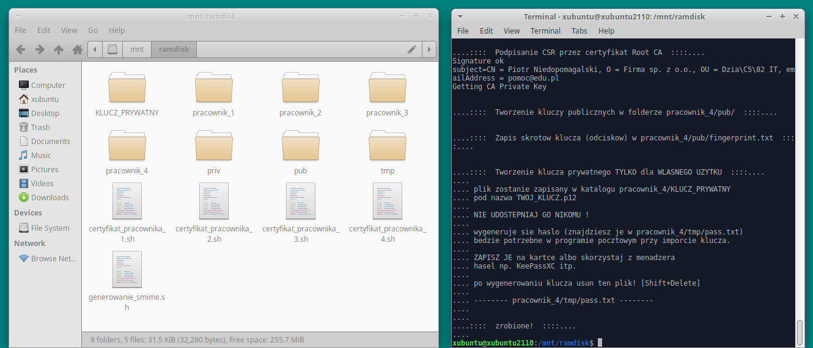

# Dodatkowe certyfikaty
plik `generowanie_smime.bat` nadaje się do tworzenia certyfikatu dla 1 adresu e-mail (na Imię i Nazwisko); ew. można dodać następne adresy jako alternatywnie "podczepione" do certyfikatu ("subjectAltName").

Co jeśli prowadzimy firmę i chcemy każdemu pracownikowi utworzyć certyfikat?

## Schemat certyfikatów dla każdego pracownika
Utworzymy listę pracowników i zrobimy listę adresów, pod które trzeba zrobić certyfikaty.

```

Firma sp. z o.o.
PL
Mazowieckie
Warszawa

```

Pracownik | stanowisko | adres e-mail
| ----------- | ----------- | ----------- |
Jan Kowalski | prezes | `jkowalski@edu.pl`
Adam Nowak | wiceprezes | `anowak@edu.pl` `szkolenia@edu.pl`
Grażyna Kowalska | sekretarka | `biuro@edu.pl`
Aneta Rachunek | księgowa | `faktury@edu.pl`
Piotr Niedopomagalski | technik it | `pomoc@edu.pl`

## Tworzenie głównego i pierwszego certyfikatu z listy (`generowanie_smime.bat`)
Trzeba **ręcznie** skonfigurować skrypt. Z przykładu powyżej będzie wyglądać np. tak (znajdź i zmień poniższe wiersze na własne):

### prezes `generowanie_smime.bat`

```

set o=Firma sp. z o.o.
set email=jkowalski@edu.pl
...
set cn=Firma sp. z o.o. CA e-mail
...
echo ....::::  Generowanie ustawien dla Root CA  ::::....
...
echo stateOrProvinceName=Mazowieckie>> priv\%root_cnf%
echo localityName=Warszawa>> priv\%root_cnf%
...
echo ....::::  Generowanie ustawien dla certyfikatu e-mail  ::::....
...
echo commonName=Jan Kowalski>> priv\%klient_cnf%
echo organizationName=%o%>> priv\%klient_cnf%
echo organizationalUnitName=Prezes>> priv\%klient_cnf%

```

## Tworzenie następnych certyfikatów e-mail (`certyfikat_pracownika.bat`)
plik `certyfikat_pracownika_....bat` musi znajdować się "obok" głównego skryptu generującego (`generowanie_smime.bat`) w folderze.

### wiceprezes `certyfikat_pracownika_1.bat`

```

set cn=Adam Nowak
set o=Firma sp. z o.o.
set email=anowak@edu.pl
set alias=pracownik_1
...
echo organizationalUnitName=Wiceprezes>> %alias%\priv\%klient_cnf%
...
echo email.2=szkolenia@edu.pl>> priv\%klient_cnf%


```

### sekretarka `certyfikat_pracownika_2.bat`

```

set cn=Grażyna Kowalska
set o=Firma sp. z o.o.
set email=biuro@edu.pl
set alias=pracownik_2
...
echo organizationalUnitName=Sekretariat>> %alias%\priv\%klient_cnf%

```

### następni pracownicy `certyfikat_pracownika_....bat` jw.
Jeśli generowany jest klucz np. po 1 roku od wygenerowania głównego, to trzeba zmienić `set client_waznosc_dni=3650`, żeby ważność certyfikatu następnego pracownika nie była dłuższa niż certyfikatu `priv\root.crt`. Dokładną datę wygaśnięcia znajdziesz w pliku `priv\root.crt.txt`: ("Not After : ...")

### Sprawdź folder `TEST` i przetestuj czy pliki działają na twoim urządzeniu, w twoim programie pocztowym.


## Udostępnianie certyfikatów (kluczy publicznych) na stronie www firmy
Można to zrobić w takiej formie:

|| adres e-mail | certyfikat Office | certyfikat Thunderbird | odcisk SHA-1||
| ----------- | ----------- | ----------- | ----------- | ----------- | ----------- |
Firma sp. z o.o. |  |  | `pub/01root.crt` | `pub/fingerprint.txt`
Jan Kowalski | jkowalski@edu.pl | `pub/klucz_publiczny.p7b` | `pub/02user.crt` | `pub/fingerprint.txt`
Adam Nowak | anowak@edu.pl, szkolenia@edu.pl | `pracownik_1/pub/klucz_publiczny.p7b` | `pracownik_1/pub/02user.crt` | `pracownik_1/pub/fingerprint.txt`
Grażyna Kowalska | biuro@edu.pl | `pracownik_2/pub/klucz_publiczny.p7b` | `pracownik_2/pub/02user.crt` | `pracownik_2/pub/fingerprint.txt`
Aneta Rachunek | faktury@edu.pl | `pracownik_3/pub/klucz_publiczny.p7b` | `pracownik_3/pub/02user.crt` | `pracownik_3/pub/fingerprint.txt`
Piotr Niedopomagalski | pomoc@edu.pl | `pracownik_4/pub/klucz_publiczny.p7b` | `pracownik_4/pub/02user.crt` | `pracownik_4/pub/fingerprint.txt`

Będzie to wyglądać mniej więcej tak:

|| adres e-mail | certyfikat Office | certyfikat Thunderbird | odcisk SHA-1||
| ----------- | ----------- | ----------- | ----------- | ----------- | ----------- |
Firma sp. z o.o. |  |  | [Cert. główny](/firma.crt) | `32:9A:CC:A2:47:06:78:3E:A1:0F:01:C3:A8:F6:55:3F:ED:B4:42:DF`
Jan Kowalski | jkowalski@edu.pl | [p7b](/jkowalski.p7b) | [crt](/jkowalski.crt) | `08:68:4D:38:82:69:48:5D:EE:71:9D:90:8C:7D:BE:DD:C8:7B:F5:CF`
Adam Nowak | anowak@edu.pl, szkolenia@edu.pl | [p7b](/anowak.p7b) | [crt](/anowak.crt) | `71:ED:52:63:11:9E:20:F2:B3:8B:25:18:05:A4:51:77:A6:B8:20:DC`
Grażyna Kowalska | biuro@edu.pl | [p7b](/biuro.p7b) | [crt](/biuro.crt) | `9B:68:8A:6A:EB:AB:98:AD:0B:5D:D0:C8:19:E0:21:3A:5C:08:9D:83`
Aneta Rachunek | faktury@edu.pl | [p7b](/faktury.p7b) | [crt](/faktury.crt) | `92:E7:5D:02:13:09:67:60:83:0C:28:8A:FE:6F:F4:D2:5F:8C:B6:AE`
Piotr Niedopomagalski | pomoc@edu.pl | [p7b](/pomoc.p7b) | [crt](/pomoc.crt) | `AB:50:59:38:41:EC:3D:39:05:20:DD:67:8A:C7:C6:EF:62:F9:E2:85`

## [Dodatkowe bezpieczeństwo] Stosuj klucze zewnętrzne Yubico/Nitrokey
Dla każdego pracownika kup klucz (crypto-stick). Nie przenoś kluczy prywatnych (.p12, katalog priv) na urządzenia codziennego użytku. Podczas tworzenia kluczy użyj dedykowanego komputera nie podłączonego pod internet np. Live-CD z oprogramowaniem do kopiowania kluczy na crypto-sticka. Zachowaj kopie wygenerowanych plików w bezpiecznym miejscu np. na pendrive; nie podłączaj go do komputera codziennego użytku.





[](https://www.youtube.com/watch?v=U1rUYRbBL_c)
