# Funkcje skryptu generującego certyfikat S/MIME

##### v6 27/03/2022

## Klasy certyfikatów
skrypt | nazwa | klasa
| ----------- | ----------- | -----------
`generowanie_smime.bat` | *Free S/MIME Certificate* | Klasa 1/2
`generowanie_smime.bat` (po modyfikacji) + `certyfikat_pracownika.bat` | *Corporate S/MIME Certificate* | Klasa 3

## Obsługiwane systemy
skrypt | system | wersja
| ----------- | ----------- | -----------
`generowanie_smime.bat`, `certyfikat_pracownika.bat` | Windows | 7+
`generowanie_smime.sh`, `certyfikat_pracownika.sh` | Linux | 5.13.0+ np. Ubuntu 21.10

## Przetestowane wersje OpenSSL
| OpenSSL |
|-----------|
| 1.1.1i |
| 1.1.1l |
| 1.1.1m |

## Nazwy plików
plik | funkcja
| ----------- | -----------
`.pem` | klucz prywatny
`.p12` | klucz prywatny zawierający zestaw kluczy: 1 prywatny usera (`.pem`), 1 publiczny usera (`.crt`), 1 publiczny roota (`.crt`)
`.crt` | klucz publiczny (certyfikat)
`.p7b` | 2 klucze publiczne `.crt` (1 publiczny usera + 1 publiczny roota)
`.cnf`, `.srl` | pliki konfiguracyjne
`.txt` | logi z przeprowadzonych operacji





## Schemat klucza `.p12`



## Schemat klucza `.p7b`



## W katalogu `TEST` znajdują się wygenerowane pliki testowe
Sprawdź czy działają w twoim programie pocztowym.

## Schemat wygenerowanych folderów


folder | funkcja
| ----------- | -----------
priv | klucz prywatny `.pem`, klucz publiczny `.crt`, pliki konfiguracyjne, logi
pub | klucze publiczne (certyfikaty) `.p7b`, odcisk (fingerprint) klucza, suma kontrolna plików
tmp | folder tymczasowy, HASŁO do otwarcia pliku `.p12`
KLUCZ_PRYWATNY | klucz prywatny `.p12` (importuj do programu pocztowego / na klucz YubiKey)



## S/MIME vs GnuPG
[](https://xkcd.com/1181/)

## Jak zacząć?
Wygeneruj certyfikat. Zainstaluj go w swoim programie pocztowym. Wyślij podpisanego (certyfikatem) e-maila, w podpisie umieść informację gdzie można pobrać klucz publiczny np.:

```

--

Jan Kowalski
Prezes zarządu
Firma sp. z o.o.

Wiadomość podpisana certyfikatem
https://www.firma.edu.pl/certyfikaty/

```

Osoba odbierająca e-maila będzie musiała zainstalować na swoim komputerze klucz publiczny. Jeśli korzysta z Windows/Outlook: plik `.p7b`; jeśli korzysta z Thunderbirda pliki: `01root.crt` i `02user.crt`.

## Linki
Zobacz komentarze w pliku `generowanie_smime.bat`.

---

· [Encrypted e-mail](https://arstechnica.com/information-technology/2013/06/encrypted-e-mail-how-much-annoyance-will-you-tolerate-to-keep-the-nsa-away/)

· [How to secure your e-mail under Mac OS X and iOS 5 with S/MIME](https://arstechnica.com/gadgets/2011/10/secure-your-e-mail-under-mac-os-x-and-ios-5-with-smime/)

· [S/MIME, Email and Yubikey](https://blog.ligos.net/2017-01-02/Smime-Email-and-Yubikey.html)
